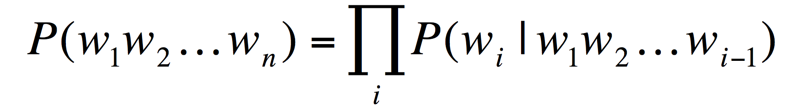

# RNN_language_modelling
## Summary 
Generating text using language modelling of different corpora

## Introduction 
Language modelling is inherent in several applications from speech recognition to natural language understanding. In its essence, language modelling is simply detecting which words are likely to come after another by performing analysis on a given training set. 

Given language modelling however, is it possible to generate text that imitates a given training set. For example, is it possible for a computer to generate a Edgar Allan Poe poem? Or a Shakesperian sonnet? Having read these works, I can definitely see a pattern in the language each author uses. Is it possible however, for a computer to detect these patterns embedded in the text? 

## Background Knowledge 
### Language Modelling 
Language models work by generating a probability of each word occurring in a sentence. For example, given a sentence composed of words (W): 

W1 W2 W3 W4 W5 

We can compute the probability of the sentence using the chain rule: 

P(W1,W2,W3,W4,W5)=P(W1)P(W2|W1)P(W3|W2,W1)P(W4|W3,W2,W1)P(W5|W4,W3,W2,W1)

This can be generalized to the equation: 

However while this method works for relatively small sentences, it can be computationally expensive when performing modelling on large texts. To work around this, previous models such as N-gram proababilistic models only performed 
